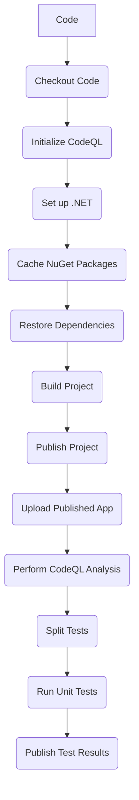
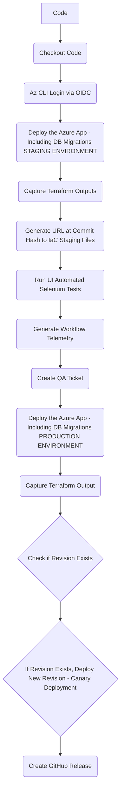

# 🎬 RazorPagesMovie CI/CD with GitHub Actions

This repository demonstrates how to set up a CI/CD pipeline for a Razor Pages Movie application using GitHub Actions. The pipeline includes building, testing, and deploying the application to Azure Container Apps.

## 🌟 Overview

The CI/CD pipeline is defined using GitHub Actions workflows and Terraform for infrastructure as code. The main workflows are:

- **🔄 CI Workflow**: Builds and tests the application.
- **🚀 CD Workflow**: Deploys the application to Azure and runs UI tests.
- **🧹 Housekeeping Workflow**: Cleans up resources after testing.

## 🛠️ CI/CD Practices

### 🔄 Continuous Integration (CI)

Continuous Integration ensures that every change to the codebase is automatically built and tested. This helps catch issues early and maintain code quality. The CI workflow is triggered on push and pull request events and performs the following steps:

1. **📥 Checkout Code**: Checks out the repository code.
2. **⚙️ Set up .NET**: Sets up the .NET environment.
3. **📦 Restore Dependencies**: Restores the project dependencies.
4. **🏗️ Build Project**: Builds the project.
5. **🔍 CodeQL Analysis**: Performs CodeQL analysis on the codebase to identify potential security vulnerabilities.
6. **🧪 Run Tests**: Runs unit tests and uploads test results.

Mermaid diagram:

  
CI Workflow Steps

### 🚀 Continuous Delivery (CD)

Continuous Delivery automatically deploys the application to Azure Container Apps whenever changes are pushed to the main branch. This ensures that the latest version of the application is always available in the staging and production environments. The CD workflow includes:
1. **📦 Build and Deploy Container Image**: Builds the container image and deploys it to a container registry.
2. **📥 Checkout Code**: Checks out the repository code.
3. **🔑 Az CLI Login via OIDC**: Logs in to Azure CLI using OIDC.
4. **🚀 Deploy the Azure App - Including DB Migrations [STAGING ENVIRONMENT]**: Deploys the application to the staging environment using Terraform.
5. **🧪 Run UI Automated Selenium Tests**: Runs UI tests using Selenium.
6. **📊 Generate Workflow Telemetry**: Generates heat map and performance data.
7. **📝 Create QA Ticket**: Creates a QA ticket to notify that the staging environment is ready for testing.
8. **🚀 Deploy the Azure App - Including DB Migrations [PRODUCTION ENVIRONMENT]**: Deploys the application to the production environment using Terraform.
9. **📄 Capture Terraform Output**: Captures the Terraform output.
10. **🏷️ Create GitHub Release**: Creates a GitHub release with the deployment details.

    
CD Workflow Steps

