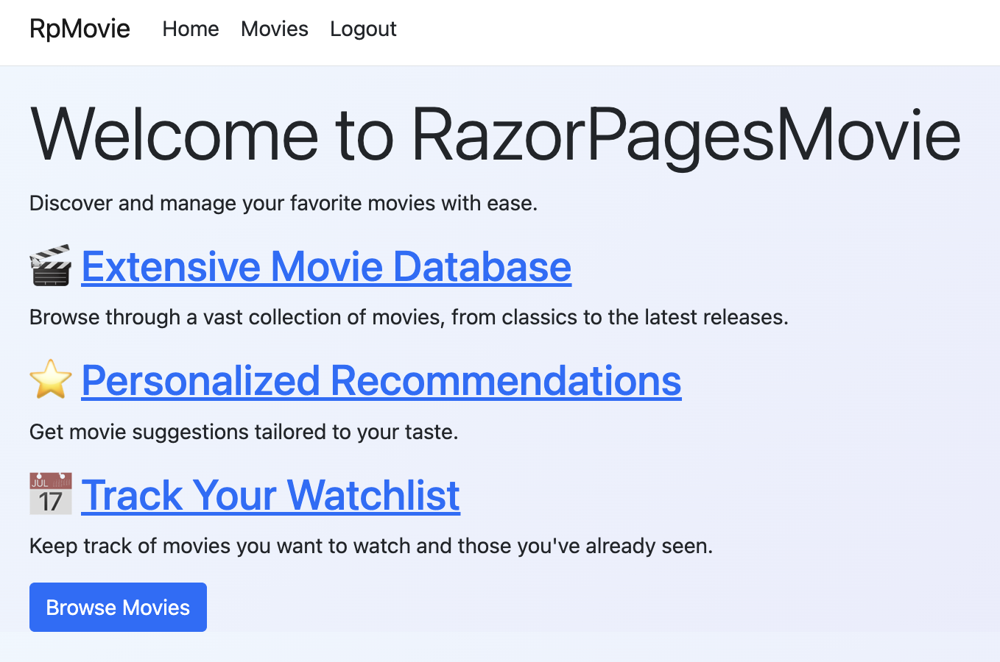
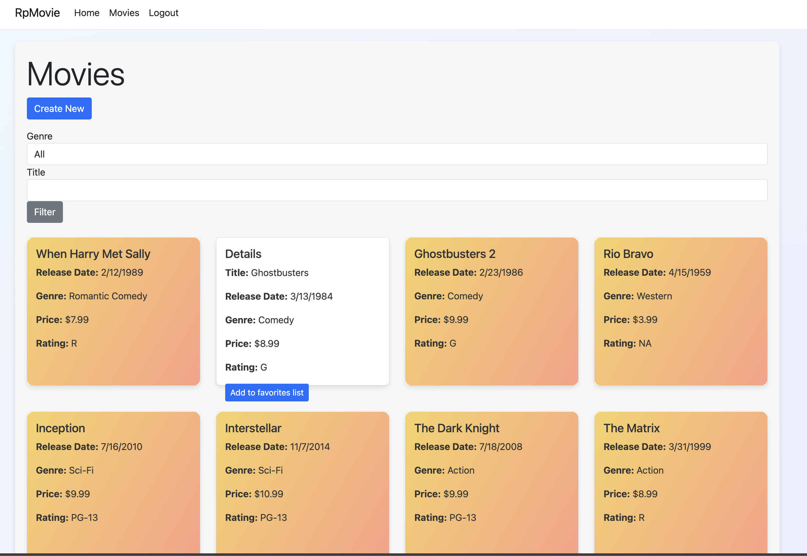
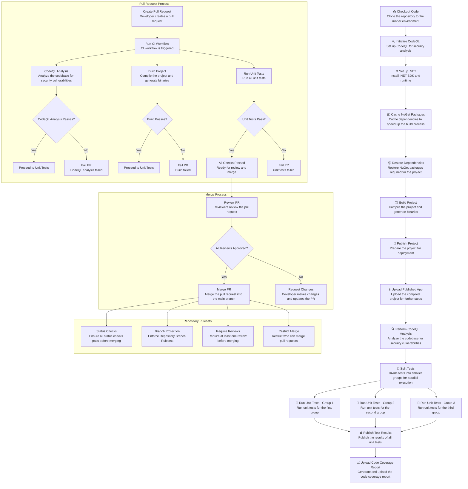
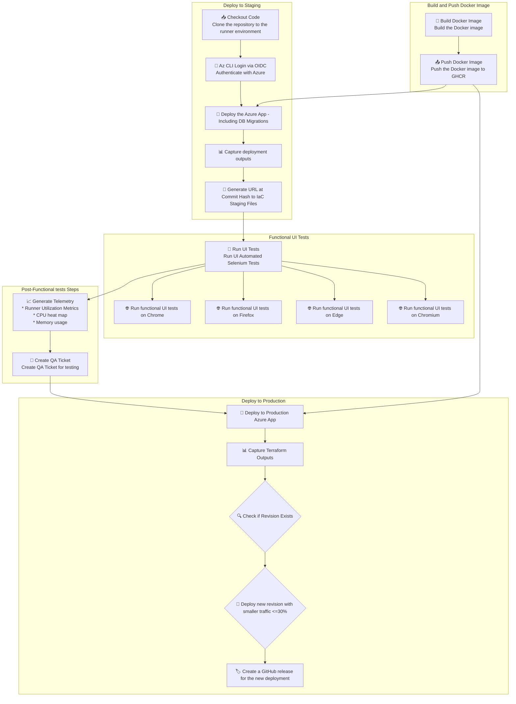
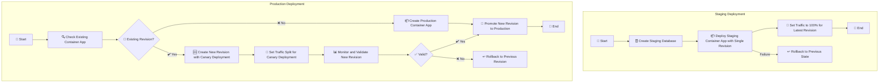
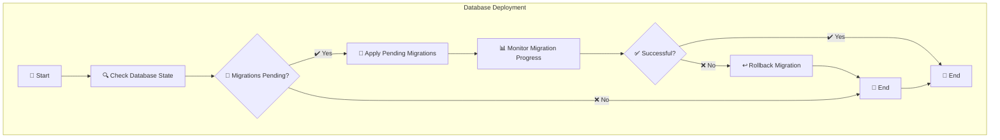

# 🎬 RazorPagesMovie CI/CD with GitHub Actions

This repository demonstrates how to set up a CI/CD pipeline for a Razor Pages Movie application using GitHub Actions. The pipeline includes building, testing, and deploying the application to Azure Container Apps.

## 🌟 Overview

The Razor Pages Movie application is a simple movie list application that allows users to view, create, edit, and delete movies. The application is built using the following technologies:
- **Frontend**: Razor Pages, HTML, CSS, Bootstrap
- **Backend**: ASP.NET Core Razor Pages, Entity Framework Core
- **Database**: Azure SQL Or SQL Server Database
- **Testing**: xUnit, Selenium
- **Deployment**: Azure Container Apps via OIDC (OpenID Connect)
- **Infrastructure**: Terraform (IaC)
- **CI/CD**: GitHub Actions
- **Monitoring**: Application Insights on Azure Portal
- **GitHub Advanced Security**: CodeQL Analysis, secret scanning, Dependabot alerts, GitHub Copilot Auto-Fix suggestions on PRs

<div style="display: flex; justify-content: space-between;">
  
  
</div>

## 💻 🚀 Running the app localy
To run the Razor Pages Movie application locally using Docker Compose, follow these steps:

1. Ensure you have Docker and Docker Compose installed on your machine.
2. Navigate to the root directory of your project where the `docker-compose.yml` file is located.
3. Run the following command to start the application:

```sh
docker compose up
```

This command will start both the SQL Server and the web application containers. 

## 🚀 Running the app in GitHub Codespaces
To run the Razor Pages Movie application in GitHub Codespaces with the default .devcontainer setup, follow these steps:

Open the repository in GitHub Codespaces.
The .devcontainer setup will automatically start the application on startup on port 80.

## 🌐 Accessing the Application
The landing page will prompt you to login. By default, there are two main user logins for demonstration purposes:
- **Admin**: Username: `admin`, Password: `password`
- **User**: Username: `user`, Password: `password`


The web application will be accessible at: [http://localhost](http://localhost)

<details>
  <summary>Disclaimer - expand to read</summary> 

The application is not yet fully functional and is still under development.
The default behavior is that the application will run on http://localhost with SSL/TLS certificate validation disabled when connecting to the SQL Server. This is achieved by adding the `TrustServerCertificate` parameter to the connection string in the `docker-compose.yml` file. This allows the application to connect to the SQL Server without validating the SSL/TLS certificate.

</details>

## 🚀 Deployment Pipline in CI/CD
The CI/CD pipeline is defined using GitHub Actions workflows and Terraform for infrastructure as code. The main workflows are:

- **🔄 CI Workflow**: Builds and tests the application.
- **🚀 CD Workflow**: Deploys the application to Azure and runs UI tests.
- **🧹 Housekeeping Workflow**: Cleans up resources after testing.

## 🛠️ CI/CD Practices

### 🔄 Continuous Integration (CI)

Continuous Integration ensures that every change to the codebase is automatically built and tested. This helps catch issues early and maintain code quality. The CI workflow is triggered on push and pull request events and performs the following steps:

1. **📥 Checkout Code**: Checks out the repository code.
2. **⚙️ Set up .NET**: Sets up the .NET environment.
3. **📦 Restore Dependencies**: Restores the project dependencies.
4. **🏗️ Build Project**: Builds the project.
5. **🔍 CodeQL Analysis**: Performs CodeQL analysis on the codebase to identify potential security vulnerabilities.
6. **🧪 Run Tests**: Runs unit tests and uploads test results.


✨ **Interactive Diagram Below!** ✨

<details>
  <summary style="font-size: 1.2em; font-weight: bold; color: #0073e6; cursor: pointer;">🔍 Click to expand and view the CI Workflow Steps chart</summary>


</details>

### 🚀 Continuous Delivery (CD)

Continuous Delivery automatically deploys the application to Azure Container Apps whenever changes are pushed to the main branch. This ensures that the latest version of the application is always available in the staging and production environments. The CD workflow includes:
1. **📦 Build and Deploy Container Image**: Builds the container image and deploys it to a container registry.
2. **📥 Checkout Code**: Checks out the repository code.
3. **🔑 Az CLI Login via OIDC**: Logs in to Azure CLI using OIDC.
4. **🚀 Deploy the Azure App - Including DB Migrations [STAGING ENVIRONMENT]**: Deploys the application to the staging environment using Terraform.
5. **🧪 Run UI Automated Selenium Tests**: Runs UI tests using Selenium.
6. **📊 Generate Workflow Telemetry**: Generates heat map and performance data.
7. **📝 Create QA Ticket**: Creates a QA ticket to notify that the staging environment is ready for testing.
8. **🚀 Deploy the Azure App - Including DB Migrations [PRODUCTION ENVIRONMENT]**: Deploys the application to the production environment using Terraform.
9. **📄 Capture Terraform Output**: Captures the Terraform output.
10. **🏷️ Create GitHub Release**: Creates a GitHub release with the deployment details.

✨ **Interactive Diagram Below!** ✨
<details>
  <summary style="font-size: 1.2em; font-weight: bold; color: #0073e6; cursor: pointer;">🔍 Click to expand and view the CD Workflow Steps chart</summary>



</details>

## 🔄 Deployment Strategies

### Staging vs Production Deployment Flow - Canary Deployment
This deployment strategy is orchestrated with the Terraform scripts located in the `terraform` folder.



### Database Deployments Rollout

Database deployments are handled as part of the application deployment process. During the deployment, database migrations are applied to ensure the database schema is up-to-date. If the deployment fails, the changes are rolled back to the previous state to maintain database integrity.

