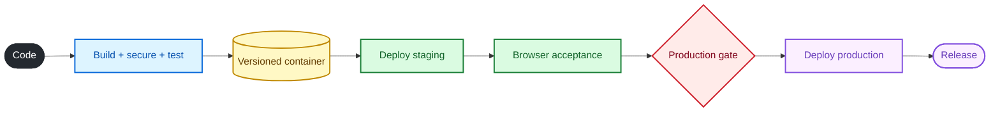
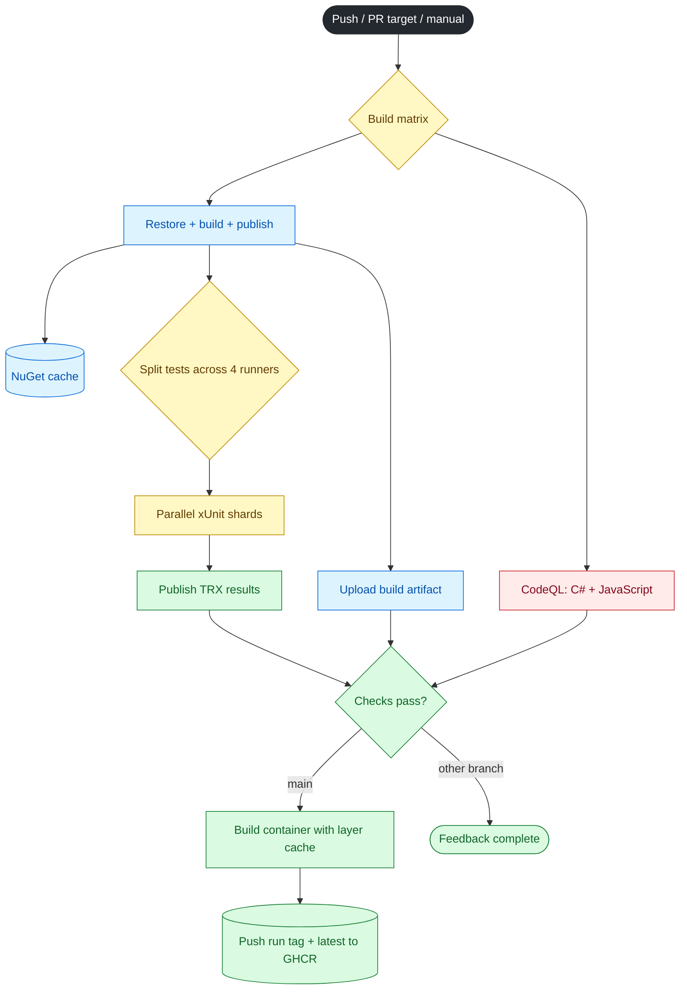
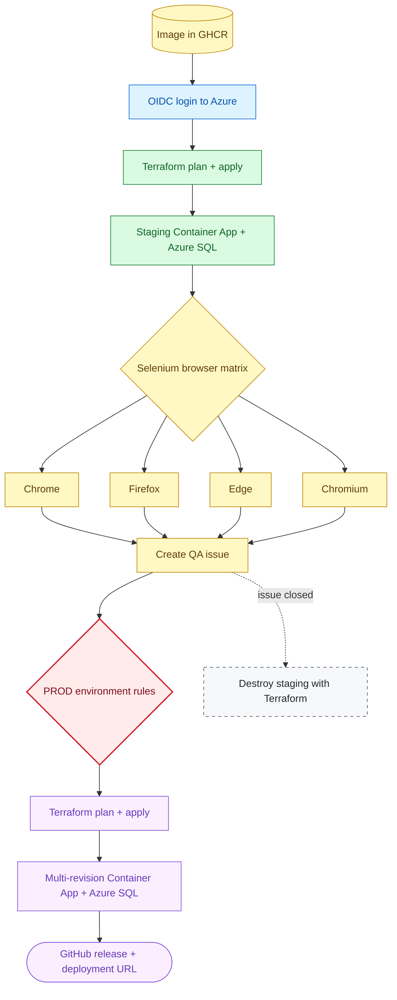
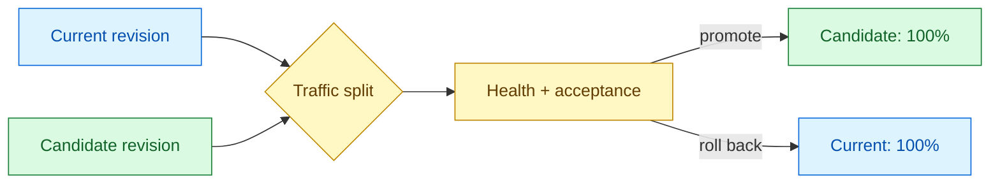

# GitHub Actions CI/CD on Azure

This repository demonstrates an end-to-end delivery system for an ASP.NET Core application. GitHub Actions is the control plane for build, security, testing, container publishing, Azure deployment, approval, release, and cleanup.

## The pipeline


```mermaid
flowchart LR
    Code([Code]) --> CI[Build + secure + test]
    CI --> Image[(Versioned container)]
    Image --> Stage[Deploy staging]
    Stage --> Accept[Browser acceptance]
    Accept --> Gate{Production gate}
    Gate --> Prod[Deploy production]
    Prod --> Release([Release])

    classDef source fill:#24292f,color:#fff,stroke:#24292f,stroke-width:2px;
    classDef ci fill:#ddf4ff,color:#0550ae,stroke:#0969da,stroke-width:2px;
    classDef artifact fill:#fff8c5,color:#633c01,stroke:#bf8700,stroke-width:2px;
    classDef stage fill:#dafbe1,color:#116329,stroke:#1a7f37,stroke-width:2px;
    classDef gate fill:#ffebe9,color:#82071e,stroke:#cf222e,stroke-width:2px;
    classDef prod fill:#fbefff,color:#6639ba,stroke:#8250df,stroke-width:2px;

    class Code source;
    class CI ci;
    class Image artifact;
    class Stage,Accept stage;
    class Gate gate;
    class Prod,Release prod;
```

| **Trigger** | **Continuous integration** | **Artifact** | **Continuous delivery** | **Evidence** |
| --- | --- | --- | --- | --- |
| Push, PR target, or manual run | Build, CodeQL, parallel unit tests | Versioned image in GHCR | Terraform, staging UI tests, production gate | Checks, artifacts, QA issue, release |

## Continuous integration

The [CI workflow](.github/workflows/ci.yml) optimizes for fast, trustworthy feedback.


```mermaid
flowchart TD
    Trigger([Push / PR target / manual]) --> Matrix{Build matrix}
    Matrix --> DotNet[Restore + build + publish]
    Matrix --> CodeQL[CodeQL: C# + JavaScript]
    DotNet --> Cache[(NuGet cache)]
    DotNet --> Split{Split tests across 4 runners}
    Split --> Tests[Parallel xUnit shards]
    Tests --> Results[Publish TRX results]
    DotNet --> Artifact[Upload build artifact]
    CodeQL --> Ready{Checks pass?}
    Results --> Ready
    Artifact --> Ready
    Ready -- main --> Docker[Build container with layer cache]
    Docker --> GHCR[(Push run tag + latest to GHCR)]
    Ready -- other branch --> Done([Feedback complete])

    classDef trigger fill:#24292f,color:#fff,stroke:#24292f;
    classDef work fill:#ddf4ff,color:#0550ae,stroke:#0969da;
    classDef parallel fill:#fff8c5,color:#633c01,stroke:#bf8700;
    classDef security fill:#ffebe9,color:#82071e,stroke:#cf222e;
    classDef output fill:#dafbe1,color:#116329,stroke:#1a7f37;

    class Trigger trigger;
    class DotNet,Cache,Artifact work;
    class Matrix,Split,Tests parallel;
    class CodeQL security;
    class Results,Ready,Docker,GHCR,Done output;
```

### What makes it efficient

- NuGet caching avoids repeated dependency downloads.
- Four test shards scale unit tests horizontally on independent runners.
- Build artifacts are produced once and reused by the container job.
- Docker layer caching reduces image build time.
- CodeQL runs alongside the build instead of becoming a later security phase.
- Marketplace actions add test splitting, reporting, telemetry, Docker publishing, and optional interactive debugging.

## Continuous delivery

The reusable [CD workflow](.github/workflows/cd.yml) promotes the version-specific image tag produced by CI.


```mermaid
flowchart TD
    GHCR[(Image in GHCR)] --> OIDC[OIDC login to Azure]
    OIDC --> StageTF[Terraform plan + apply]
    StageTF --> Stage[Staging Container App + Azure SQL]
    Stage --> Browsers{Selenium browser matrix}
    Browsers --> Chrome[Chrome]
    Browsers --> Firefox[Firefox]
    Browsers --> Edge[Edge]
    Browsers --> Chromium[Chromium]
    Chrome --> QA[Create QA issue]
    Firefox --> QA
    Edge --> QA
    Chromium --> QA
    QA --> Gate{PROD environment rules}
    Gate --> ProdTF[Terraform plan + apply]
    ProdTF --> Prod[Multi-revision Container App + Azure SQL]
    Prod --> Release([GitHub release + deployment URL])
    QA -. issue closed .-> Cleanup[Destroy staging with Terraform]

    classDef artifact fill:#fff8c5,color:#633c01,stroke:#bf8700;
    classDef auth fill:#ddf4ff,color:#0550ae,stroke:#0969da;
    classDef stage fill:#dafbe1,color:#116329,stroke:#1a7f37;
    classDef test fill:#fff8c5,color:#633c01,stroke:#bf8700;
    classDef gate fill:#ffebe9,color:#82071e,stroke:#cf222e,stroke-width:2px;
    classDef prod fill:#fbefff,color:#6639ba,stroke:#8250df;
    classDef cleanup fill:#f6f8fa,color:#24292f,stroke:#57606a,stroke-dasharray: 5 5;

    class GHCR artifact;
    class OIDC auth;
    class StageTF,Stage stage;
    class Browsers,Chrome,Firefox,Edge,Chromium,QA test;
    class Gate gate;
    class ProdTF,Prod,Release prod;
    class Cleanup cleanup;
```

### Deployment behavior

- GitHub OIDC provides short-lived Azure control-plane credentials without a stored service-principal secret.
- Terraform creates repeatable staging and production infrastructure using remote state.
- Selenium fans out across Chrome, Firefox, Edge, and Chromium before production.
- A QA issue records the image, staging URL, Terraform commit, and manual checklist.
- The `PROD` environment can enforce required reviewers, wait timers, and scoped secrets.
- Closing a labeled staging issue triggers deprovisioning; manual cleanup is also available.
- Entity Framework Core migrations and seed initialization run when each application revision starts.

## Best practices

| Practice | How this repository demonstrates it |
| --- | --- |
| Build once, promote forward | CI publishes a version-specific image tag; CD deploys that tag to each environment. |
| Parallelize independent work | Build analysis, unit-test shards, and browser acceptance use native matrices and job dependencies. |
| Use short-lived cloud identity | GitHub OIDC replaces a long-lived Azure service-principal secret. |
| Apply least privilege | Workflow permissions are declared per job. |
| Keep infrastructure reviewable | Terraform plans and applies Azure Container Apps and Azure SQL changes. |
| Put controls at risk boundaries | Repository rulesets can protect merges; GitHub Environments can protect deployments. |
| Preserve delivery evidence | Checks, test reports, artifacts, issues, environments, and releases stay linked to commits. |
| Automate the full lifecycle | Provisioning and cleanup are both event-driven workflows. |
| Design migrations for coexistence | Zero-downtime delivery requires backward-compatible, expand-and-contract database changes. |

> Repository rulesets and environment approval rules are configured in GitHub settings. The workflows reference these controls but do not define them.

## Benefits and features

| Feature | Benefit |
| --- | --- |
| Native GitHub triggers | Pushes, PR activity, schedules, issue closure, and manual dispatch all become automation events. |
| Caching at multiple layers | NuGet and Docker caches reduce repeated work and runner time. |
| Elastic test execution | Unit and UI tests fan out without maintaining a custom orchestration service. |
| Integrated security | Code scanning shares the same checks and review experience as CI. |
| Azure Container Apps revisions | Multiple revisions provide the foundation for blue-green, canary, and zero-downtime strategies. |
| Protected environments | Approval and secret boundaries can differ between staging and production. |
| Infrastructure as code | Environments are reproducible, reviewable, and disposable. |
| Automated handoffs | Issues connect automated acceptance with human QA and trigger cleanup when closed. |
| End-to-end traceability | A customer can follow a change from commit to test evidence, image, deployment, and release. |

### Strategy extensions

The current production configuration uses multiple-revision mode and sends 100% of traffic to the latest revision. Azure Container Apps also supports a fuller progressive-delivery design:


```mermaid
flowchart LR
    Blue[Current revision] --> Traffic{Traffic split}
    Green[Candidate revision] --> Traffic
    Traffic --> Observe[Health + acceptance]
    Observe -- promote --> Green100[Candidate: 100%]
    Observe -- roll back --> Blue100[Current: 100%]

    classDef current fill:#ddf4ff,color:#0550ae,stroke:#0969da;
    classDef candidate fill:#dafbe1,color:#116329,stroke:#1a7f37;
    classDef decision fill:#fff8c5,color:#633c01,stroke:#bf8700;

    class Blue,Blue100 current;
    class Green,Green100 candidate;
    class Traffic,Observe decision;
```

Progressive traffic shifting, health-based rollback, explicit autoscaling rules, and automatic database rollback are extension strategies, not currently automated by this repository.

<details>
<summary><strong>Application demo and local setup</strong></summary>

The sample workload is an ASP.NET Core Razor Pages movie application backed by SQL Server.

<p align="center">
  
  
</p>

Run it locally with Docker Compose:

```bash
docker compose up
```

Open [http://localhost](http://localhost). Demo logins are `admin` / `password` and `user` / `password`.

This application is a demonstration and is not production hardened. The managed Azure Container Apps environment is a shared prerequisite referenced by Terraform. Database and application credentials still require secure secret management.

</details>
