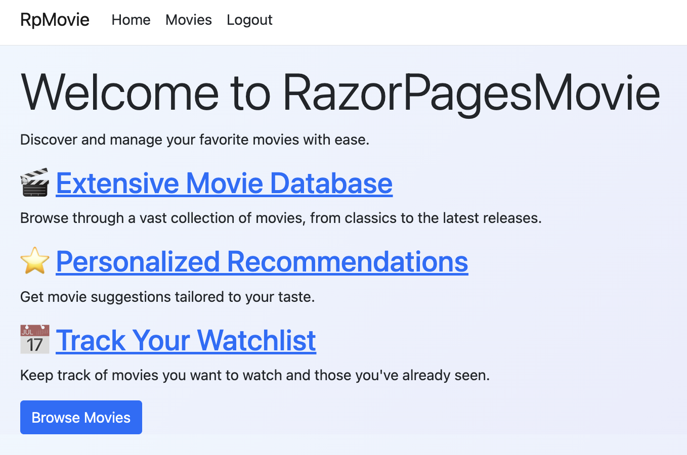
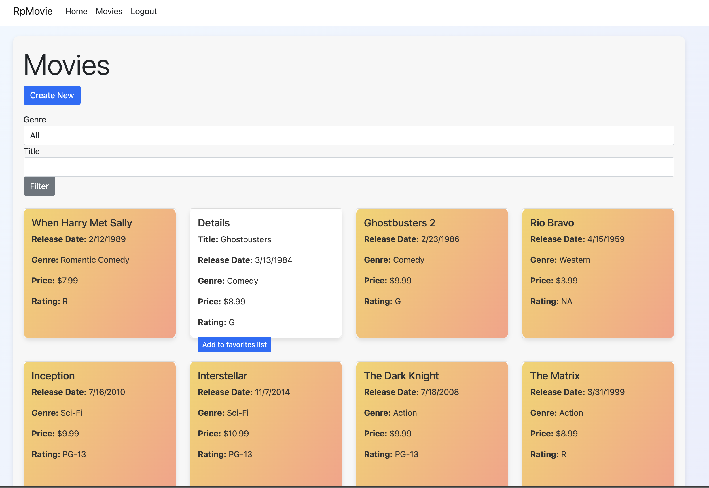
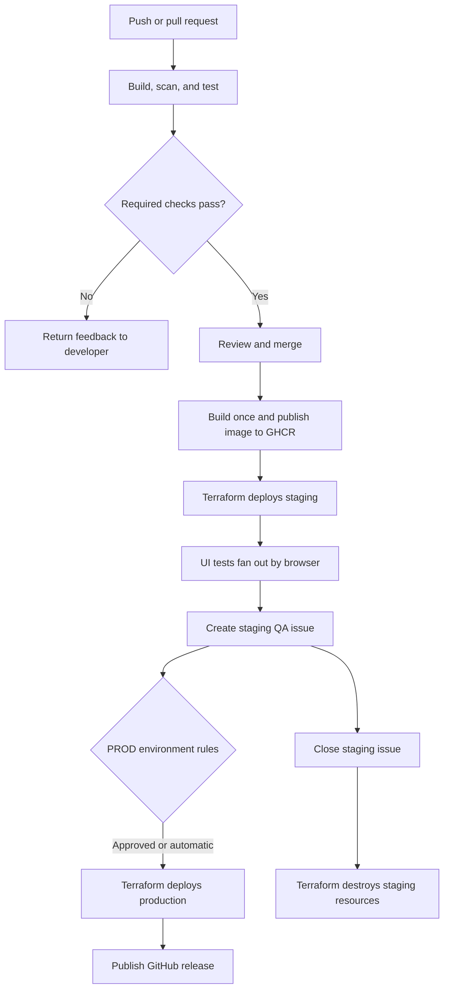
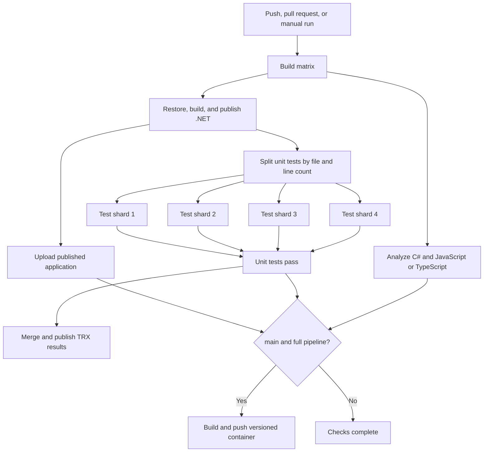
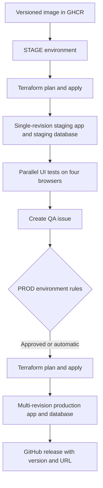
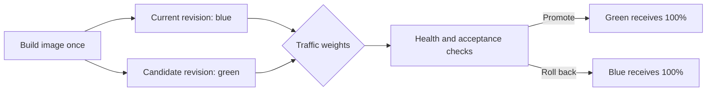
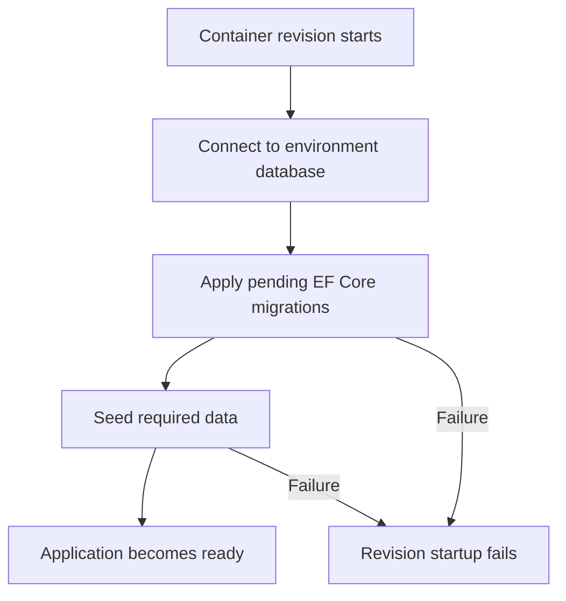
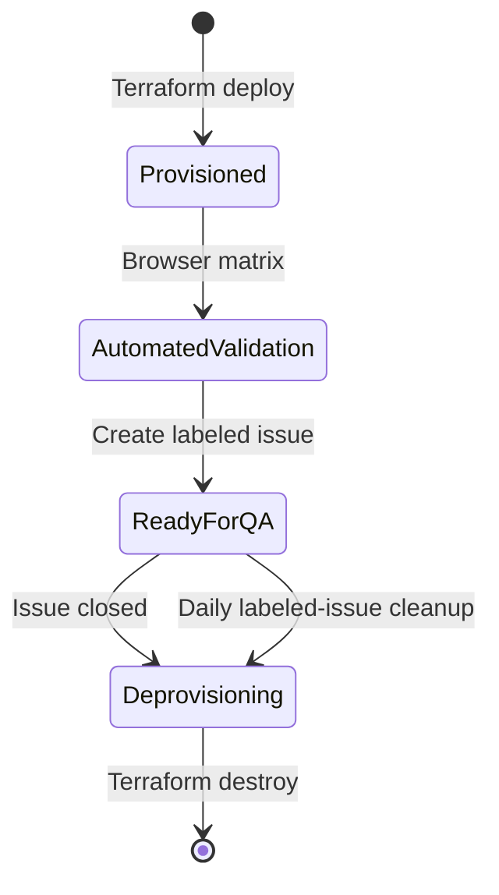

# Razor Pages Movie: CI/CD with GitHub Actions

This repository is a working reference for building, testing, securing, deploying, validating, and cleaning up an ASP.NET Core application with GitHub Actions.

The application is intentionally simple. The delivery system is the demonstration: native GitHub events connect source control, parallel tests, container publishing, Azure infrastructure, acceptance testing, human approval, release evidence, and environment cleanup in one auditable workflow.

<div align="center">
  
  
</div>

## What this demonstrates

| Delivery goal | GitHub and Azure capability | Customer value |
| --- | --- | --- |
| Fast feedback | Dependency caching, Docker layer caching, artifacts, and parallel test matrices | Shorter feedback loops and less repeated work |
| Built-in security | CodeQL and least-privilege workflow permissions | Security checks run with the build instead of after it |
| Elastic validation | Unit tests split across four runners; UI tests fan out across four browsers | More coverage without serial execution time |
| Consistent promotion | One version-specific image is published to GitHub Container Registry and promoted by tag | The tested image is the image that advances |
| Keyless cloud authentication | GitHub OIDC authenticates to Azure | No long-lived Azure service-principal secret is stored in GitHub |
| Repeatable infrastructure | Terraform plans and applies Azure Container Apps and Azure SQL resources | Infrastructure changes are reviewable and reproducible |
| Controlled delivery | Staging validation, a QA issue, and GitHub Environment boundaries | Automation moves quickly while configured protection rules retain control at the risk boundary |
| Lifecycle automation | Closing a staging QA issue triggers Terraform deprovisioning | Temporary environments do not depend on someone remembering to remove them |
| Traceability | Checks, test reports, artifacts, issues, environments, and releases remain linked to a commit | A deployment has a durable evidence trail |

## Contents

- [Continuous integration](#continuous-integration)
- [Continuous delivery](#continuous-delivery)
- [Deployment strategies](#deployment-strategies)
- [Database migrations](#database-migrations)
- [Environment lifecycle](#environment-lifecycle)
- [Architecture](#architecture)
- [Workflow catalog](#workflow-catalog)
- [Run locally](#run-locally)

## Delivery journey


```mermaid
flowchart TD
    Change[Push or pull request] --> CI[Build, scan, and test]
    CI --> Checks{Required checks pass?}
    Checks -- No --> Fix[Return feedback to developer]
    Checks -- Yes --> Merge[Review and merge]
    Merge --> Image[Build once and publish image to GHCR]
    Image --> Stage[Terraform deploys staging]
    Stage --> Browser[UI tests fan out by browser]
    Browser --> QA[Create staging QA issue]
    QA --> Gate{PROD environment rules}
    Gate -- Approved or automatic --> Prod[Terraform deploys production]
    Prod --> Release[Publish GitHub release]
    QA --> Close[Close staging issue]
    Close --> Cleanup[Terraform destroys staging resources]
```

The workflow uses GitHub as the control plane. A commit starts the process, job dependencies define promotion order, environments provide deployment boundaries, issues record manual acceptance work, and releases record the outcome. The QA issue is a handoff and audit artifact; production approval is enforced only when protection rules are configured on the `PROD` environment.

## Continuous integration

The [CI workflow](.github/workflows/ci.yml) runs on pushes, `pull_request_target`, and manual dispatches. A full deployment is only started from `main`.

> **Pull request note:** the current `pull_request_target` job checks out the base revision, not the proposed pull request head. It demonstrates a privileged PR trigger, but should be changed to a carefully permissioned `pull_request` workflow when validation of contributed code is required.


```mermaid
flowchart TD
    Trigger[Push, pull request, or manual run] --> BuildMatrix[Build matrix]
    BuildMatrix --> DotNet[Restore, build, and publish .NET]
    BuildMatrix --> CodeQL[Analyze C# and JavaScript or TypeScript]
    DotNet --> Artifact[Upload published application]
    DotNet --> Split[Split unit tests by file and line count]
    Split --> T1[Test shard 1]
    Split --> T2[Test shard 2]
    Split --> T3[Test shard 3]
    Split --> T4[Test shard 4]
    T1 --> TestsPass[Unit tests pass]
    T2 --> TestsPass
    T3 --> TestsPass
    T4 --> TestsPass
    TestsPass --> Report[Merge and publish TRX results]
    Artifact --> Main{main and full pipeline?}
    TestsPass --> Main
    CodeQL --> Main
    Main -- Yes --> Container[Build and push versioned container]
    Main -- No --> Done[Checks complete]
```

### Efficient by design

- NuGet dependencies are cached for build, unit-test, and UI-test jobs.
- Unit tests use a generated matrix to fan out across four independent runners.
- Build output is uploaded once and reused by the container job.
- Docker Buildx restores layers from the `latest` image and writes an inline cache.
- Test results and runner telemetry are uploaded as GitHub artifacts for inspection.
- Marketplace actions provide focused capabilities for test splitting, test reporting, Docker publishing, telemetry, and optional interactive debugging.

### Security and governance

- CodeQL analyzes both C# and JavaScript/TypeScript paths.
- Job permissions are declared explicitly instead of granting every job broad access.
- Repository rulesets can require CI checks and reviews before changes reach `main`.
- GitHub Environments named `STAGE` and `PROD` can enforce reviewers, wait timers, and environment-specific secrets.
- Azure control-plane login uses OIDC and short-lived tokens, eliminating a stored service-principal secret. Database and application credentials still require secure secret management.

Repository rulesets and environment protection rules are configured in GitHub settings, so their exact enforcement is controlled outside the workflow files.

## Continuous delivery

The [CD workflow](.github/workflows/cd.yml) is reusable. CI passes it the version-specific run-number image tag produced by the container build. Digest-based deployment would be required for strict image immutability.


```mermaid
flowchart TD
    Image[Versioned image in GHCR] --> StageGate[STAGE environment]
    StageGate --> StageTF[Terraform plan and apply]
    StageTF --> StageApp[Single-revision staging app and staging database]
    StageApp --> TestMatrix[Parallel UI tests on four browsers]
    TestMatrix --> Ticket[Create QA issue]
    Ticket --> ProdGate{PROD environment rules}
    ProdGate -- Approved or automatic --> ProdTF[Terraform plan and apply]
    ProdTF --> ProdApp[Multi-revision production app and database]
    ProdApp --> Release[GitHub release with version and URL]
```

### Staging and acceptance

Terraform creates a dedicated staging database and a single-revision Azure Container App. Selenium tests then run in parallel against Chrome, Firefox, Edge, and Chromium. Production cannot begin unless every browser job succeeds.

After automated acceptance passes, GitHub creates a QA issue containing:

- the deployed image tag;
- the staging URL;
- a commit-pinned link to the Terraform configuration;
- a manual verification checklist.

This turns a GitHub issue into a lightweight handoff between automation and a human tester. Issue creation satisfies the workflow dependency; closing or approving the issue is not a production gate.

## Deployment strategies

### Production promotion today

The production job targets the `PROD` environment and only runs from `main`. When environment protection rules are configured, required reviewers or wait timers pause the job before deployment. Terraform configures Azure Container Apps in multiple-revision mode, routes the configured traffic percentage to the latest revision, and records the application URL in a GitHub release.

### Illustrative blue-green extension

Azure Container Apps revisions provide the primitives for blue-green or canary delivery: deploy a second revision, assign a label, shift a small percentage of traffic, observe it, then promote or route traffic back. The current Terraform configuration sends 100% of traffic to the latest revision; it does not automate canary observation, progressive traffic shifting, or revision rollback.


```mermaid
flowchart LR
    Build[Build image once] --> Blue[Current revision: blue]
    Build --> Green[Candidate revision: green]
    Blue --> Split{Traffic weights}
    Green --> Split
    Split --> Observe[Health and acceptance checks]
    Observe -- Promote --> Green100[Green receives 100%]
    Observe -- Roll back --> Blue100[Blue receives 100%]
```

Multiple-revision mode is the foundation for zero-downtime application promotion because an existing revision can continue serving traffic while a candidate starts and is evaluated. Completing that strategy requires health checks and explicit traffic-shifting automation. Database changes also require backward-compatible migration practices while two application versions may run together.

### Rollback boundaries

Application rollback can route traffic back to a healthy Container Apps revision once revision management is automated. Database rollback is a separate concern and must account for data written after deployment. The current CD failure handler attempts to restore Terraform state metadata; it does not reverse Azure changes, application traffic, or database migrations.

### Scaling

Azure Container Apps can scale revisions with minimum and maximum replica counts, HTTP concurrency rules, and KEDA-based event rules. The current Terraform relies on platform/provider defaults and does not define explicit scaling rules. Adding workload-specific limits and signals is an extension strategy for this demo.

## Database migrations

Entity Framework Core migrations run when the application starts. Each environment has its own Azure SQL database, and startup fails if migration or seed initialization fails.


```mermaid
flowchart TD
    Start[Container revision starts] --> Connect[Connect to environment database]
    Connect --> Migrate[Apply pending EF Core migrations]
    Migrate --> Seed[Seed required data]
    Seed --> Ready[Application becomes ready]
    Migrate -- Failure --> Fail[Revision startup fails]
    Seed -- Failure --> Fail
```

The repository includes a manual migration rollback helper, but the active GitHub Actions workflows do not automatically reverse database migrations. Production-grade zero-downtime delivery should use expand-and-contract schema changes, backups, and an explicitly tested rollback or roll-forward procedure.

## Environment lifecycle

Temporary environments are useful only when cleanup is just as easy as creation.


```mermaid
stateDiagram-v2
    [*] --> Provisioned: Terraform deploy
    Provisioned --> AutomatedValidation: Browser matrix
    AutomatedValidation --> ReadyForQA: Create labeled issue
    ReadyForQA --> Deprovisioning: Issue closed
    ReadyForQA --> Deprovisioning: Daily labeled-issue cleanup
    Deprovisioning --> [*]: Terraform destroy
```

The housekeeping workflows demonstrate three cleanup paths:

- [Issue-driven staging cleanup](.github/workflows/housekeeping-staging-qa-issue-closed.yml) runs when a labeled QA issue is closed.
- [Scheduled labeled-issue cleanup](.github/workflows/housekeeping-staging-close-stale-qa-issues.yml) currently closes every open issue labeled `staging` each day, which triggers deprovisioning. It does not calculate issue age.
- [Manual environment cleanup](.github/workflows/housekeeping-destroy-demo-resources.yml) destroys demo staging and production resources on demand, subject to environment controls.

Terraform destroy retries once after refreshing remote state. This handles the case where Azure completes an asynchronous deletion but the provider fails while polling the operation; a repeated real failure still fails the job.

## Architecture

| Layer | Technology |
| --- | --- |
| Application | ASP.NET Core Razor Pages, Entity Framework Core, Bootstrap |
| Unit testing | xUnit with split test execution and TRX reporting |
| Acceptance testing | Selenium across Chrome, Firefox, Edge, and Chromium |
| Security | CodeQL and GitHub workflow permissions |
| Artifact registry | GitHub Container Registry |
| Runtime | Azure Container Apps |
| Data | Azure SQL Database |
| Infrastructure | Terraform with remote Azure state |
| Cloud authentication | GitHub OIDC to Microsoft Azure |
| Delivery control | GitHub Actions, Environments, Issues, and Releases |

## Workflow catalog

| Workflow | Trigger | Responsibility |
| --- | --- | --- |
| [CI](.github/workflows/ci.yml) | Push, `pull_request_target`, manual | Build, CodeQL, unit tests, image publishing, and CD orchestration |
| [CD](.github/workflows/cd.yml) | Reusable call or manual | Staging deployment, browser acceptance, QA handoff, production deployment, and release |
| [Destroy on issue close](.github/workflows/housekeeping-staging-qa-issue-closed.yml) | Labeled issue closed | Plan and destroy the staging environment |
| [Close stale QA issues](.github/workflows/housekeeping-staging-close-stale-qa-issues.yml) | Daily or manual | Close open staging issues to start cleanup |
| [Destroy demo resources](.github/workflows/housekeeping-destroy-demo-resources.yml) | Manual | Tear down staging and production resources |

## Run locally

### Docker Compose

Prerequisites: Docker with Docker Compose.

```bash
docker compose up
```

The application and local SQL Server start together. Open [http://localhost](http://localhost).

### GitHub Codespaces

Create a Codespace for the repository. The development container configures the environment and starts the application on port 80.

### Demo accounts

| Role | Username | Password |
| --- | --- | --- |
| Administrator | `admin` | `password` |
| User | `user` | `password` |

These credentials are for the demo application only and must not be used in a production system.

## Important implementation notes

- The application is a demonstration and is not production hardened.
- Local SQL connectivity uses `TrustServerCertificate` for development convenience.
- Azure resource identifiers in the Terraform variable files are specific to the demo subscription and resource group.
- The managed Azure Container Apps environment is a shared prerequisite; the application Terraform configurations reference it but do not create it.
- Deployment safety depends on GitHub Environment protection and repository rules configured for the repository.
- The staging configuration currently contains a storage account connection string and should be migrated to GitHub Secrets, Azure Key Vault, or managed identity before production use.
